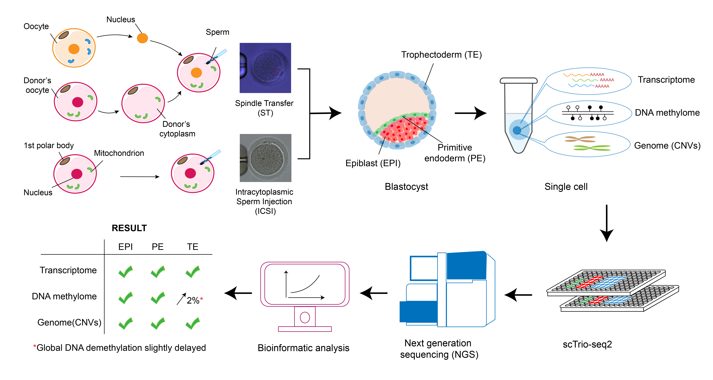

# MRT_scTrio-seq2 Human Embryo Multi-omics Analysis Pipeline

This repository contains computational tools for analyzing human embryo data sequenced using the [scTrio-seq2](https://doi.org/10.1038/s41586-019-1500-0) technology, which simultaneously profiles RNA transcriptome, DNA methylation, and copy number variations (CNVs) in single cells.

## Table of Contents

- [Overview](#overview)
- [Repository Structure](#repository-structure)
- [Data Availability](#data-availability)
- [System Requirements](#system-requirements)
- [Analysis Workflows](#analysis-workflows)
  - [RNA Transcriptome Analysis](#1-rna-transcriptome-analysis)
  - [DNA Methylation Analysis](#2-dna-methylation-analysis)
- [Citation](#citation)
- [Contact](#contact)

## Overview

**scTrio-seq2** is a single-cell multi-omics sequencing technology that enables simultaneous detection of:
- **RNA Transcriptome**: Gene expression profiles at single-cell resolution
- **DNA Methylation**: CpG, CHG, and CHH methylation states
- **Copy Number Variations (CNVs)**: Copy number variations

This pipeline analyzes molecular differences between embryonic cell lineages under two treatment conditions:
- **Embryonic cell lineages**: epiblast (EPI), primitive endoderm (PE), trophectoderm (TE)
- **Treatment conditions**: Intracytoplasmic Sperm Injection (ICSI), Spindle Transfer (ST)



## Repository Structure

```
├── README.md                          # Project documentation
├── analysis/                          # Analysis results and log
│   ├── scTrio-seq2.pdf                # Analysis log for main results
│   ├── DNA_methylome/                 # DNA methylation analysis results
│   │   ├── scripts/                   # Scripts for raw data processing
│   │   └── scTrio_DNA.R               # Data preprocess and visualization
│   └── RNA_transcriptome/             # RNA transcriptome analysis results
│       ├── scripts/                   # Scripts for raw data processing
│       ├── s01.Preprocess.R           # Data preprocessing
│       ├── s02.Comparative_analysis.R # Comparative analysis
│       └── s03.inferCNV.R             # Copy number variation inference
├── metadata/                          # Sample metadata and information
│   ├── Blasts_metainfo.xlsx
│   ├── HRA001110_updata.xlsx
│   ├── metadata.txt
│   ├── collide_cells.txt
│   ├── MRT_RNA.CellsPass_info.txt
│   └── MRT_Meth.CellsPass_info.txt
└── public/                            # Reference datasets
    ├── known_imprinted_DMR.txt
    ├── X_linked_genelist.txt
    └── Y_linked_genelist.txt
```

## Data Availability

- **Raw Sequencing Data**: Available at GSA for Human under accession [HRA001110](https://ngdc.cncb.ac.cn/gsa-human/browse/HRA001110)
- **Processed Data**: Available at [Figshare](https://doi.org/10.6084/m9.figshare.30462572.v1)
- **Reference Datasets**: Included in [`public/`](public/) directory

**Note**: Some single cells in raw sequencing data in GSA somehow encounter barcode collision. In case of confusion, exclude cells listed in [`metadata/collide_cells.txt`](metadata/collide_cells.txt). Otherwise, please reach out to expression matrices in Zenodo.

## System Requirements

### Software Dependencies:
- **R** ≥ 4.0
- **R Packages**: Seurat, ggplot2, ComplexHeatmap, data.table, Rtsne, SCENIC
- **System Tools**: samtools, bedtools, bismark, MethylDackel
- **Python**: For SCENIC analysis (loompy, scanpy)

### Hardware Requirements:
- **Memory**: ≥8GB RAM recommended
- **Storage**: ≥100GB for intermediate files
- **CPU**: Multi-core processor for parallel processing

## Analysis Workflows

### 1. RNA Transcriptome Analysis
- [`s01.Preprocess.R`](scRNA/s01.Preprocess.R) - Data preprocessing and quality control
- [`s02.Comparative_analysis.R`](scRNA/s02.Comparative_analysis.R) - Comparative analysis between conditions
- [`s03.inferCNV.R`](scRNA/s03.inferCNV.R) - Copy number variation inference

**Analysis Steps:**
1. **Quality Control**: Filter low-quality cells and genes
2. **Normalization**: LogNormalize method with scale factor 1e+5
3. **Dimensionality Reduction**: PCA followed by t-SNE
4. **Cell Type Annotation**: Based on lineage marker genes (EPI, PE, TE)
5. **Differential Expression**: Identify treatment-specific gene signatures
6. **Regulatory Network Analysis**: SCENIC transcription factor networks
7. **CNV Detection**: inferCNV algorithm for chromosomal alterations

### 2. DNA Methylation Analysis

**Main Components:**
- [`PBAT_pipeline.sh`](scPBAT/PBAT_pipeline.sh) - Complete PBAT processing workflow
- [`FindDMR.sh`](scPBAT/FindDMR.sh) - DMR detection pipeline

**Analysis Steps:**
1. **Data Preprocessing**: Quality filtering and normalization
2. **Methylation Profiling**: CpG, CHG, CHH methylation quantification
3. **Genomic Annotation**: Gene body, promoter, CGI region analysis
4. **Differential Methylation**: DMR identification between conditions
5. **Developmental Trajectory**: PCA-based pseudotime analysis
6. **Integration Analysis**: Combine with transcriptome data

## Citation

If you use this code or data, please cite:

**Qi S, Wang W, Xue X, Lu Z, Yan J, Li Y, et al. (2022) Single-cell multiomics analyses of spindle-transferred human embryos suggest a mostly normal embryonic development. PLoS Biol 20(8): e3001741.**

DOI: https://doi.org/10.1371/journal.pbio.3001741

## Contact

For questions about the analysis pipeline or data, please refer to the original publication or create an issue in this repository.